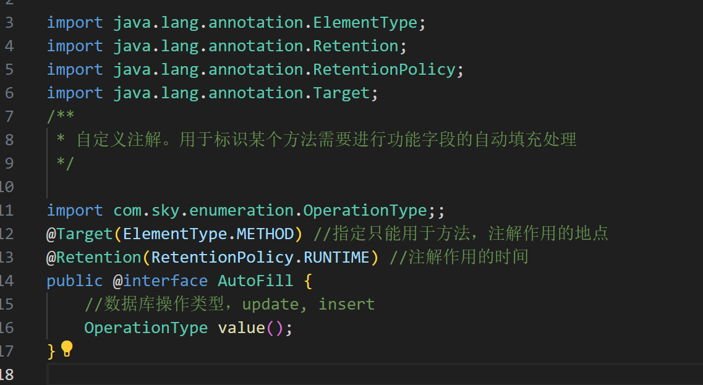
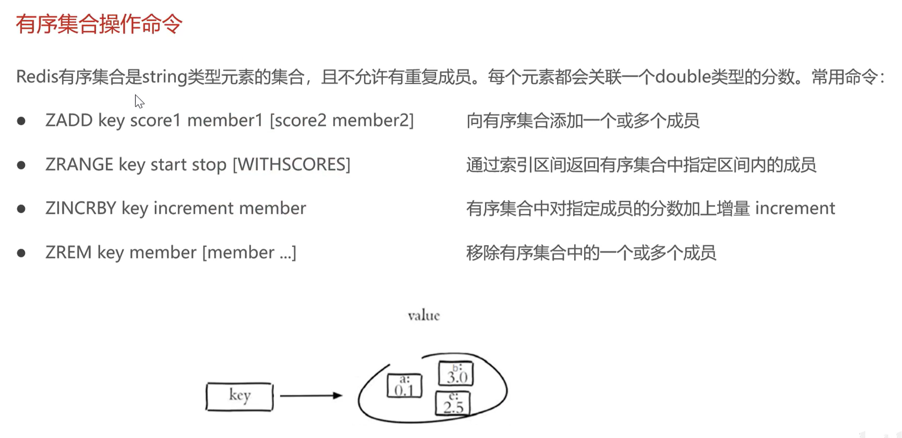

# 苍穹外卖

# day1

## sky-pojo

Entity——实体，通常和数据库中的表对应
DTO——数据传输对象，通常用于程序各层之间传递数据
VO——视图对象，为前端展示数据提供对象
POJO——普通JAVA对象，只有属性和对应的getter和setter

## sky-server

配置文件、配置类、拦截器、controller、service、mapper、启动类等。


## 数据库信息

| 序号 | 数据表名      | 中文名称       |
| ---- | ------------- | -------------- |
| 1    | employee      | 员工表         |
| 2    | category      | 分类表         |
| 3    | dish          | 菜品表         |
| 4    | dish_flavor   | 菜品口味表     |
| 5    | setmeal       | 套餐表         |
| 6    | setmeal_dish  | 套餐菜品关系表 |
| 7    | user          | 用户表         |
| 8    | address_book  | 地址表         |
| 9    | shopping_cart | 购物车表       |
| 10   | orders        | 订单表         |
| 11   | order_detail  | 订单明细表     |

### 1. employee

employee表为员工表，用于存储商家内部的员工信息。具体表结构如下：

| 字段名      | 数据类型    | 说明         | 备注        |
| ----------- | ----------- | ------------ | ----------- |
| id          | bigint      | 主键         | 自增        |
| name        | varchar(32) | 姓名         |             |
| username    | varchar(32) | 用户名       | 唯一        |
| password    | varchar(64) | 密码         |             |
| phone       | varchar(11) | 手机号       |             |
| sex         | varchar(2)  | 性别         |             |
| id_number   | varchar(18) | 身份证号     |             |
| status      | int         | 账号状态     | 1正常 0锁定 |
| create_time | datetime    | 创建时间     |             |
| update_time | datetime    | 最后修改时间 |             |
| create_user | bigint      | 创建人id     |             |
| update_user | bigint      | 最后修改人id |             |

### 2. category

category表为分类表，用于存储商品的分类信息。具体表结构如下：

| 字段名      | 数据类型    | 说明         | 备注                 |
| ----------- | ----------- | ------------ | -------------------- |
| id          | bigint      | 主键         | 自增                 |
| name        | varchar(32) | 分类名称     | 唯一                 |
| type        | int         | 分类类型     | 1菜品分类  2套餐分类 |
| sort        | int         | 排序字段     | 用于分类数据的排序   |
| status      | int         | 状态         | 1启用 0禁用          |
| create_time | datetime    | 创建时间     |                      |
| update_time | datetime    | 最后修改时间 |                      |
| create_user | bigint      | 创建人id     |                      |
| update_user | bigint      | 最后修改人id |                      |

### 3. dish

dish表为菜品表，用于存储菜品的信息。具体表结构如下：

| 字段名      | 数据类型      | 说明         | 备注        |
| ----------- | ------------- | ------------ | ----------- |
| id          | bigint        | 主键         | 自增        |
| name        | varchar(32)   | 菜品名称     | 唯一        |
| category_id | bigint        | 分类id       | 逻辑外键    |
| price       | decimal(10,2) | 菜品价格     |             |
| image       | varchar(255)  | 图片路径     |             |
| description | varchar(255)  | 菜品描述     |             |
| status      | int           | 售卖状态     | 1起售 0停售 |
| create_time | datetime      | 创建时间     |             |
| update_time | datetime      | 最后修改时间 |             |
| create_user | bigint        | 创建人id     |             |
| update_user | bigint        | 最后修改人id |             |

### 4. dish_flavor

dish_flavor表为菜品口味表，用于存储菜品的口味信息。具体表结构如下：

| 字段名  | 数据类型     | 说明     | 备注     |
| ------- | ------------ | -------- | -------- |
| id      | bigint       | 主键     | 自增     |
| dish_id | bigint       | 菜品id   | 逻辑外键 |
| name    | varchar(32)  | 口味名称 |          |
| value   | varchar(255) | 口味值   |          |

### 5. setmeal

setmeal表为套餐表，用于存储套餐的信息。具体表结构如下：

| 字段名      | 数据类型      | 说明         | 备注        |
| ----------- | ------------- | ------------ | ----------- |
| id          | bigint        | 主键         | 自增        |
| name        | varchar(32)   | 套餐名称     | 唯一        |
| category_id | bigint        | 分类id       | 逻辑外键    |
| price       | decimal(10,2) | 套餐价格     |             |
| image       | varchar(255)  | 图片路径     |             |
| description | varchar(255)  | 套餐描述     |             |
| status      | int           | 售卖状态     | 1起售 0停售 |
| create_time | datetime      | 创建时间     |             |
| update_time | datetime      | 最后修改时间 |             |
| create_user | bigint        | 创建人id     |             |
| update_user | bigint        | 最后修改人id |             |

### 6. setmeal_dish

setmeal_dish表为套餐菜品关系表，用于存储套餐和菜品的关联关系。具体表结构如下：

| 字段名     | 数据类型      | 说明     | 备注     |
| ---------- | ------------- | -------- | -------- |
| id         | bigint        | 主键     | 自增     |
| setmeal_id | bigint        | 套餐id   | 逻辑外键 |
| dish_id    | bigint        | 菜品id   | 逻辑外键 |
| name       | varchar(32)   | 菜品名称 | 冗余字段 |
| price      | decimal(10,2) | 菜品单价 | 冗余字段 |
| copies     | int           | 菜品份数 |          |

### 7. user

user表为用户表，用于存储C端用户的信息。具体表结构如下：

| 字段名      | 数据类型     | 说明               | 备注 |
| ----------- | ------------ | ------------------ | ---- |
| id          | bigint       | 主键               | 自增 |
| openid      | varchar(45)  | 微信用户的唯一标识 |      |
| name        | varchar(32)  | 用户姓名           |      |
| phone       | varchar(11)  | 手机号             |      |
| sex         | varchar(2)   | 性别               |      |
| id_number   | varchar(18)  | 身份证号           |      |
| avatar      | varchar(500) | 微信用户头像路径   |      |
| create_time | datetime     | 注册时间           |      |

### 8. address_book

address_book表为地址表，用于存储C端用户的收货地址信息。具体表结构如下：

| 字段名        | 数据类型     | 说明         | 备注           |
| ------------- | ------------ | ------------ | -------------- |
| id            | bigint       | 主键         | 自增           |
| user_id       | bigint       | 用户id       | 逻辑外键       |
| consignee     | varchar(50)  | 收货人       |                |
| sex           | varchar(2)   | 性别         |                |
| phone         | varchar(11)  | 手机号       |                |
| province_code | varchar(12)  | 省份编码     |                |
| province_name | varchar(32)  | 省份名称     |                |
| city_code     | varchar(12)  | 城市编码     |                |
| city_name     | varchar(32)  | 城市名称     |                |
| district_code | varchar(12)  | 区县编码     |                |
| district_name | varchar(32)  | 区县名称     |                |
| detail        | varchar(200) | 详细地址信息 | 具体到门牌号   |
| label         | varchar(100) | 标签         | 公司、家、学校 |
| is_default    | tinyint(1)   | 是否默认地址 | 1是 0否        |

### 9. shopping_cart

shopping_cart表为购物车表，用于存储C端用户的购物车信息。具体表结构如下：

| 字段名      | 数据类型      | 说明         | 备注     |
| ----------- | ------------- | ------------ | -------- |
| id          | bigint        | 主键         | 自增     |
| name        | varchar(32)   | 商品名称     |          |
| image       | varchar(255)  | 商品图片路径 |          |
| user_id     | bigint        | 用户id       | 逻辑外键 |
| dish_id     | bigint        | 菜品id       | 逻辑外键 |
| setmeal_id  | bigint        | 套餐id       | 逻辑外键 |
| dish_flavor | varchar(50)   | 菜品口味     |          |
| number      | int           | 商品数量     |          |
| amount      | decimal(10,2) | 商品单价     |          |
| create_time | datetime      | 创建时间     |          |

### 10. orders

orders表为订单表，用于存储C端用户的订单数据。具体表结构如下：

| 字段名                  | 数据类型      | 说明         | 备注                                            |
| ----------------------- | ------------- | ------------ | ----------------------------------------------- |
| id                      | bigint        | 主键         | 自增                                            |
| number                  | varchar(50)   | 订单号       |                                                 |
| status                  | int           | 订单状态     | 1待付款 2待接单 3已接单 4派送中 5已完成 6已取消 |
| user_id                 | bigint        | 用户id       | 逻辑外键                                        |
| address_book_id         | bigint        | 地址id       | 逻辑外键                                        |
| order_time              | datetime      | 下单时间     |                                                 |
| checkout_time           | datetime      | 付款时间     |                                                 |
| pay_method              | int           | 支付方式     | 1微信支付 2支付宝支付                           |
| pay_status              | tinyint       | 支付状态     | 0未支付 1已支付 2退款                           |
| amount                  | decimal(10,2) | 订单金额     |                                                 |
| remark                  | varchar(100)  | 备注信息     |                                                 |
| phone                   | varchar(11)   | 手机号       |                                                 |
| address                 | varchar(255)  | 详细地址信息 |                                                 |
| user_name               | varchar(32)   | 用户姓名     |                                                 |
| consignee               | varchar(32)   | 收货人       |                                                 |
| cancel_reason           | varchar(255)  | 订单取消原因 |                                                 |
| rejection_reason        | varchar(255)  | 拒单原因     |                                                 |
| cancel_time             | datetime      | 订单取消时间 |                                                 |
| estimated_delivery_time | datetime      | 预计送达时间 |                                                 |
| delivery_status         | tinyint       | 配送状态     | 1立即送出  0选择具体时间                        |
| delivery_time           | datetime      | 送达时间     |                                                 |
| pack_amount             | int           | 打包费       |                                                 |
| tableware_number        | int           | 餐具数量     |                                                 |
| tableware_status        | tinyint       | 餐具数量状态 | 1按餐量提供  0选择具体数量                      |

### 11. order_detail

order_detail表为订单明细表，用于存储C端用户的订单明细数据。具体表结构如下：

| 字段名      | 数据类型      | 说明         | 备注     |
| ----------- | ------------- | ------------ | -------- |
| id          | bigint        | 主键         | 自增     |
| name        | varchar(32)   | 商品名称     |          |
| image       | varchar(255)  | 商品图片路径 |          |
| order_id    | bigint        | 订单id       | 逻辑外键 |
| dish_id     | bigint        | 菜品id       | 逻辑外键 |
| setmeal_id  | bigint        | 套餐id       | 逻辑外键 |
| dish_flavor | varchar(50)   | 菜品口味     |          |
| number      | int           | 商品数量     |          |
| amount      | decimal(10,2) | 商品单价     |          |


## 前端发送的请求如何到后端服务

前端请求地址和后端接口地址不同。

nginx反向代理：
1、提高访问速度，有缓存
2、进行负载均衡
3、保证后端服务安全

nginx.conf

反向代理的配置


匹配上/api/时，则转发到proxy_pass中。

/api/后续的路径会继续追加到新的转发地址中。


负载均衡的配置


webservers中声明的是一组服务器，通过了负载均衡那一步，会将请求均匀的分布到多台服务器中。


## 完善登陆功能

使用md5加密密码。

在数据库中将原先的明文密码改为md5加密后的密码。
然后在后端中，将从前端传入的密码先进行md5加密后在进行密码比对。

## yapi

接口管理

## swagger

swagger是帮助后端开发人员做后端接口测试的

使用Knife4j


### swagger注解


# day2

## 新增员工


接口设计


项目约定：
管理端发出的请求，统一使用/admin作为前缀
用户端发出的请求，统一使用/user作为前缀


###  代码开发

根据新增员工接口设计对应的DTO：
当前端提交的数据和实体类中对应的属性差别比较大时，建议使用DTO来封装数据。

新增员工处出现jwt校验令牌未通过的情况。

可以通过登录接口，正常登陆来获取一个令牌。

在swagger中，文档管理-全局参数设置-添加参数，添加上令牌的参数token


## 员工分页查询

业务规则

1、根据页码展示员工信息
2、每页展示10条信息
3、分页查询时可以根据需要，输入员工姓名进行查询

### 代码开发


### 代码完善

将最后操作时间的格式修改正确

两种方式，注解好理解。


## 启用禁用员工账号

动态sql


## 编辑员工

根据id查询员工信息
编辑员工信息


## 分类接口

接口设计

1、新增分类
2、分类分页查询
3、根据id删除分类
4、修改分类
5、启用禁用分类
6、根据类型查询分类


# day3

## 菜品

### 公共字段自动填充

比如创建时间 创建人id等是公共字段，很多都会有

这个时候就有公共字段自动填充以帮我们实现

为mapper的方法定义注解，拦截对应的方法来加入公共字段

自定义注解AutoFill，用于标识需要进行公共字段自动填充的方法

自定义切面类AutoFillAspect，会统一拦截加入了注解AutoFill的方法，通过反射为公共字段赋值。

在mapper的方法上加入AutoFill注解

枚举、注解、AOP、反射

```java
@Aspect //表示其是一个切面
@Component  //标注一个类为Spring容器的Bean
//后续需要探讨一下
```

#### AOP

##### 1、[AOP](https://so.csdn.net/so/search?q=AOP&spm=1001.2101.3001.7020)是什么

AOP：Aspect Oriented Programming，翻译过来就是大名鼎鼎的“**面向切面编程**”，它是对面向对象的一种补充和完善。

2、AOP中注解的含义
@Aspect：切面。表示一个横切进业务的一个对象。它里面包含切入点(Pointcut)和Advice（通知）。
@Pointcut：切入点。表示需要切入的位置，比如某些类或者某些方法，也就是先定一个范围。
@Before：Advice（通知）的一种，切入点的方法体执行之前执行。
@Around：Advice（通知）的一种，环绕切入点执行也就是把切入点包裹起来执行。
@After：Advice（通知）的一种，在切入点正常运行结束后执行。
@AfterReturning：Advice（通知）的一种，在切入点正常运行结束后执行，异常则不执行
@AfterThrowing：Advice（通知）的一种，在切入点运行异常时执行。

### annotation

声明了数据库的操作类型，以便于在自定义注解中声明


### aspect

自定义切面

```java
/**
 * 自定义切面，实现公共字段自动填充
 */
@Aspect //表示其是一个切面，切面 = 切入点 + 通知
@Component  //标注一个类为Spring容器的Bean
@Slf4j  //简化在java中添加日志的操作
public class AutoFillAspect {

    /**
     * 切入点
     */
    @Pointcut("execution(* com.sky.mapper.*.*(..)) && @annotation(com.sky.annotation.AutoFill)") //切点表达式
    public void autoFillPointCut() {}

    /**
     * 前置通知, 在通知中进行公共字段的赋值
     */
    @Before("autoFillPointCut()") //定义是哪个切入点执行前执行
    public void autoFill(JoinPoint joinPoint) {
        log.info("开始进行公共字段自动填充...");

        //第一步，获取当前被拦截的方法上的数据库操作类型
        MethodSignature signature = (MethodSignature)joinPoint.getSignature(); //方法签名对象
        AutoFill autoFill = signature.getMethod().getAnnotation(AutoFill.class); //获得方法上的注解对象
        OperationType operationType = autoFill.value(); //获得数据库操作类型

        //第二步，获取到当前被拦截方法的参数，也就是实体对象Employee实体
        Object[] args = joinPoint.getArgs();
        if(args == null || args.length == 0) { return; }

        Object entity = args[0]; //如果参数有多个，统一使用第一个，用Object，泛用性
        
        //第三步，为公共属性来统一准备赋值的数据，也就是当前时间和当前登陆的用户id
        LocalDateTime now = LocalDateTime.now();
        Long currentId = BaseContext.getCurrentId();

        //第四步，根据当前的操作类型，通过<反射>来为不同的属性赋值
        if(operationType == OperationType.INSERT) {
            //为四个公共字段赋值
            try {
                Method setCreateTime = entity.getClass().getDeclaredMethod("setCreateTime", LocalDateTime.class);
                Method setCreateUser = entity.getClass().getDeclaredMethod("setCreateUser", Long.class);
                Method setUpdateTime = entity.getClass().getDeclaredMethod("setUpdateTime", LocalDateTime.class);
                Method setUpdateUser = entity.getClass().getDeclaredMethod("setUpdateUser", Long.class);

                //通过反射为对象属性赋值
                setCreateTime.invoke(entity, now);
                setCreateUser.invoke(entity, currentId);
                setUpdateTime.invoke(entity, now);
                setUpdateUser.invoke(entity, currentId);
            } catch (Exception e) {
                e.printStackTrace();
            }
            
        }else if(operationType == OperationType.UPDATE) {
            //为两个update字段赋值
            try {
                Method setUpdateTime = entity.getClass().getDeclaredMethod("setUpdateTime", LocalDateTime.class);
                Method setUpdateUser = entity.getClass().getDeclaredMethod("setUpdateUser", Long.class);

                //通过反射为对象属性赋值
                setUpdateTime.invoke(entity, now);
                setUpdateUser.invoke(entity, currentId);
            } catch (Exception e) {
                e.printStackTrace();
            }
        }
    }

}

```

反射需要探讨一下


### 新增菜品

#### 产品原型


1、根据类型查询分类（完成）
2、文件上传
3、新增菜品

#### 数据库设计


#### 文件上传接口开发

##### 阿里云对象存储oss

通过网络随时存储和调用包括文本、图片、音频和视频在内的各种文件


#### 增添菜品

@Transactional //事务注解
保证原子性，要么全成功，要么全失败
启动类中有@EnableTransactionManagement //开启注解方式的事务管理

一、理解 Spring 事务
我们在讨论Spring 的事务前，必须先了解计算机领域的“事务”，代表着什么含义。事务 其实就是一种机制，我们常说某某中间件支持“事务”，那么就代表他能实现事务的几种特性

事务应该具有4个属性：原子性、一致性、隔离性、持久性。这四个属性通常称为ACID特性。

原子性（atomicity）：一个事务是一个不可分割的工作单位，事务中包括的操作要么都做，要么都不做。
一致性（consistency）：事务必须是使数据库从一个一致性状态变到另一个一致性状态。一致性与原子性是密切相关的。
隔离性（isolation）：一个事务的执行不能被其他事务干扰。即一个事务内部的操作及使用的数据对并发的其他事务是隔离的，并发执行的各个事务之间不能互相干扰。
持久性（durability）：持久性也称永久性（permanence），指一个事务一旦提交，它对数据库中数据的改变就应该是永久性的。接下来的其他操作或故障不应该对其有任何影响。

### 菜品分页查询

设计了DishVO


### 删除菜品


### 修改菜品

接口实现
1、根据id查询菜品，同时关联口味也要传上来
2、根据类型查询分类（已实现）
3、文件上传（已实现）
4、修改菜品


### 启售禁售菜品


# day4

套餐处理


# day5

## Redis

一个基于内存的key-value结构数据库

1、基于内存存储，读写性能高
2、适合存储热点数据（热点商品、咨询、新闻）
3、企业应用广泛





### 如何在java中使用redis


# day6

HttpClient

微信小程序开发

微信登陆

导入商品浏览功能代码

## HttpClient


```java
    /**
     * 测试通过httpclient发送get请求
     */
    @Test
    public void testGet() throws Exception{
        //创建httpclient对象
        CloseableHttpClient httpClient = HttpClients.createDefault();

        //创建请求对象,请求user下的获取营业状态接口
        HttpGet httpGet = new HttpGet("http://localhost:8080/user/shop/status");

        //发送请求, 并且接收响应结果
        CloseableHttpResponse response = httpClient.execute(httpGet);

        //获取服务端返回的状态码
        int statusCode = response.getStatusLine().getStatusCode();
        System.out.println("服务端返回的状态码为：" + statusCode);

        HttpEntity entity = response.getEntity();
        String string = EntityUtils.toString(entity);
        System.out.println("服务端返回数据为：" + string);

        //关闭资源
        response.close();
        httpClient.close();

    }
```


```java
    /**
     * 测试通过httpclient发送post请求
     */
    @Test
    public void testPost() throws Exception{
        //创建httpclient对象
        CloseableHttpClient httpClient = HttpClients.createDefault();

        //创建请求对象, 请求员工登陆接口， 该接口是一个post接口
        HttpPost httpPost = new HttpPost("http://localhost:8080/admin/employee/login");

        JSONObject jsonObject = new JSONObject();
        jsonObject.put("username", "admin");
        jsonObject.put("password", "123456");

        //post代码需要传参，构造传入接口的参数 json的账号密码
        StringEntity entity = new StringEntity(jsonObject.toString());
        //指定请求编码方式
        entity.setContentEncoding("utf-8");
        //指定传输的数据格式
        entity.setContentEncoding("application/json");
        httpPost.setEntity(entity);

        //发送请求
        CloseableHttpResponse response = httpClient.execute(httpPost);

        //解析返回结果
        int statusCode = response.getStatusLine().getStatusCode();
        System.out.println("响应码为："+ statusCode);

        HttpEntity entity1 = response.getEntity();
        String string = EntityUtils.toString(entity1);
        System.out.println("响应数据为：" + string);

        //关闭资源
        response.close();
        httpClient.close();

    }

```


## 小程序开发

### 了解小程序目录结构


## 微信用户登陆


# day7

商品缓存，购物车

## 缓存菜品

使用redis来缓存

### 问题说明

如果用户端访问量比较大，数据库访问压力也会变大。

我们使用redis来缓存菜品数据，减少数据库查询操作。


缓存逻辑分析
1、每个分类下的菜品保存一份缓存数据
2、数据库中菜品数据有变更时要清理缓存数据

1、

```java
    /**
     * 根据分类id查询菜品
     *
     * @param categoryId
     * @return
     */
    @GetMapping("/list")
    @ApiOperation("根据分类id查询菜品")
    public Result<List<DishVO>> list(Long categoryId) {

        //构造redis中的key，构造规则是：dish_分类id
        String key = "dish_" + categoryId;

        //查询redis中是否存在菜品数据
        List<DishVO> list = (List<DishVO>)redisTemplate.opsForValue().get(key);
        if(list != null && list.size() > 0) {
            //如果存在，则直接返回，不需要查询数据库
            return Result.success(list);
        }

        //如果不存在，查询数据库，再将查询到的数据放入redis中

        Dish dish = new Dish();
        dish.setCategoryId(categoryId);
        dish.setStatus(StatusConstant.ENABLE);//查询起售中的菜品

        list = dishService.listWithFlavor(dish);
        //将list放入redis中
        redisTemplate.opsForValue().set(key, list);

        return Result.success(list);
    }
```

```java
	/**
     * 清理缓存数据
     */
    private void cleanCache(String pattern) {
        Set keys = redisTemplate.keys(pattern);
        redisTemplate.delete(keys);
    }
```


## 缓存套餐

### Spring Cache

是一个框架，实现了基于注解的缓存功能，只需要简单的加一个注解，就能实现缓存功能。

其提供了一层抽象，底层可以切换不同的缓存实现，例如：
1、EHCache
2、Caffeien
3、Redis


